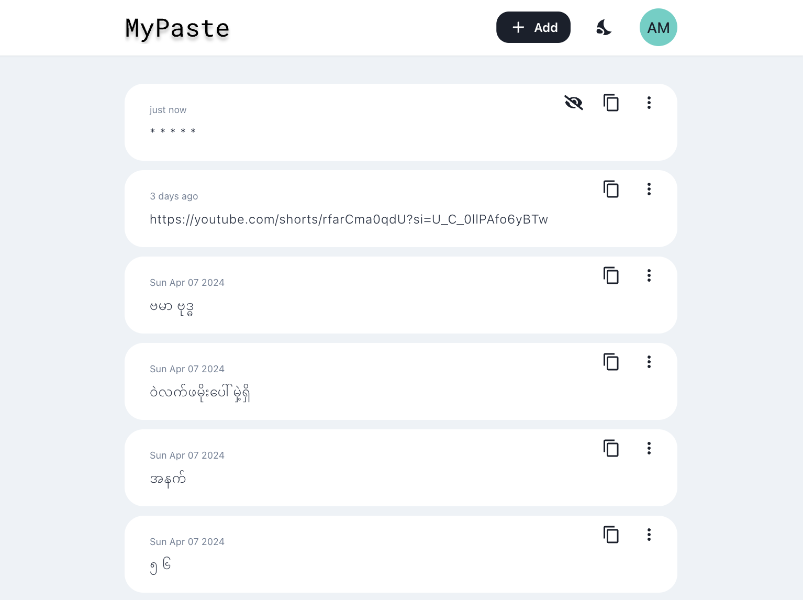
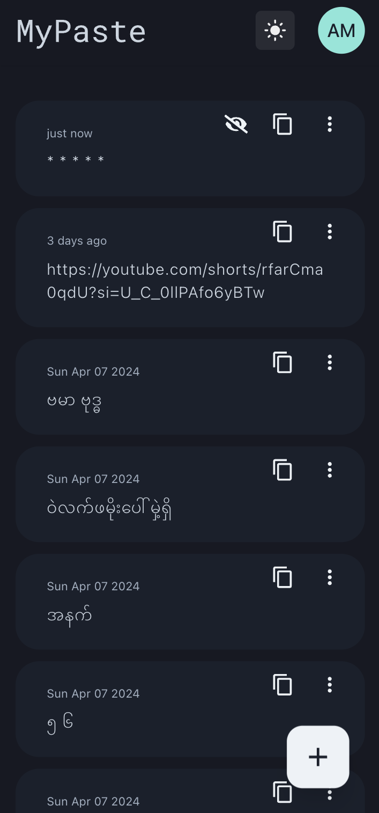

# My Paste

Quick copy and paste across your devices.

Sign in using same google account and you paste will be synced in real time.
Provide End-To-End encryption for data privacy.

## Demo
[https://mypaste.aungmaw.net](https://mypaste.aungmaw.net)

&nbsp;&nbsp;

## Develop
### Install go dependencies
```bash
go mod tidy
```

### Test
#### Run tests
```bash
go test -v ./...
```

### Run
```bash
go run .
```

### Generate Mocks
```bash
go install github.com/vektra/mockery/v2@v2.40.1
mockery
```

## Todo
- [x] Google sign in
- [x] Test setup
- [x] Webapp login redirect
- [x] Env variables
- [x] CICD to deploy on AWS
- [x] Redis stream
- [x] Event API (Add, Read)
- [x] Webapp use event API
- [x] Webapp improve UI design
- [x] Webapp store event local
- [x] Webapp e2e encrypt and key sharing between clients
